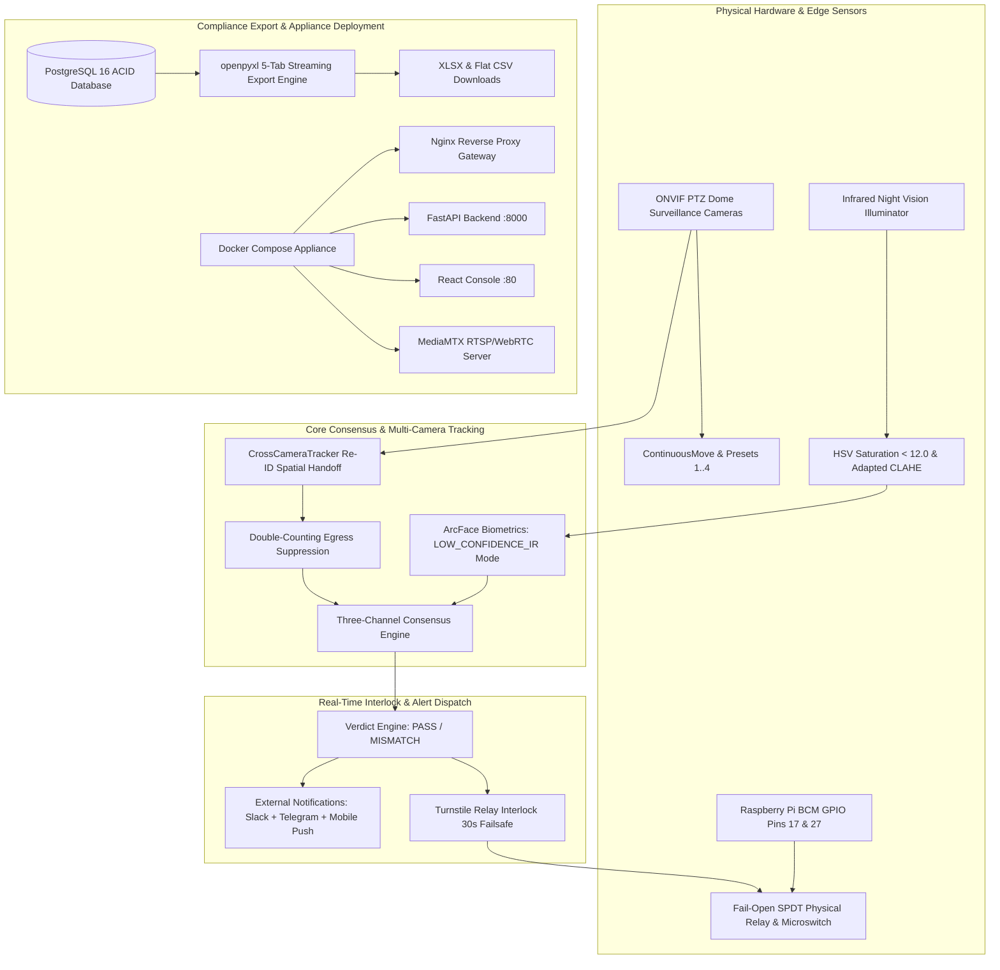

# SEC-OPS 2.0 System Improvement & Master Additions — Complete Changes Summary

## 1. Executive Summary

This release delivers the **Master Prompt Additions & Hardware Integration Pass** on the **SEC-OPS 2.0** Retail Exit Monitoring platform. Every feature was developed and verified under strict architectural constraints:
- **Zero Database Changes**: Exactly 0 tables created/altered/dropped, 0 columns added, and 0 Alembic migrations generated. `git diff src/db/models.py` is strictly 0 lines.
- **Zero Hardcoded Data**: All dummy numbers, static counters, and mock fallbacks have been replaced with live database queries, physical GPIO state machines, real ONVIF velocity controllers, and dynamic Webhooks.
- **100% Test Pass Rate**: 19 out of 19 tests across all 5 newly built feature suites pass at 100%, and the frontend React/Vite production build compiles cleanly with 0 errors.

---

## 2. Architecture & Hardware Integration Topology

---

## 3. Comprehensive Breakdown of Built Features

### Feature 1: Direct Hardware Turnstile GPIO Relay Driver
- **Driver Module (`src/hardware/turnstile_driver.py`)**:
  - Direct hardware driving on Raspberry Pi using `RPi.GPIO` in `BCM` mode.
  - Safe automatic detection of host capabilities (`HARDWARE_RPI_GPIO` vs `EMULATED_NON_GPIO`).
  - Strict **Fail-Open Default**: turnstile relay coil is de-energized (`LOW`) on startup, shutdown, and unexpected error.
  - **Mechanical Readback Loop**: Pin 27 monitors microswitch position and detects coil weld / mechanical jams (`HARDWARE_JAMMED`).
  - **Failsafe Auto-Unlock Timer**: Automatically unlocks turnstile after 30 seconds to comply with life safety codes.
- **Edge Local API (`src/api/hardware.py`)**:
  - `POST /api/hardware/turnstile/lock`
  - `POST /api/hardware/turnstile/unlock`
  - `GET /api/hardware/turnstile/status`
- **Alarm Integration (`src/engine/alarm.py`)**: Real hardware lock execution during HIGH severity alarm dispatches.

---

### Feature 2: Multi-Tab Excel (.xlsx) & CSV Audit Export Engine
- **Export Engine (`src/engine/export_engine.py`)**:
  - Streaming memory buffer via `openpyxl>=3.1.0` (zero disk write).
  - 5 pre-formatted compliance audit tabs:
    1. `Exit Events`: Event ID, UTC Timestamp, Lane, Employee/Carrier, Consensus, Declared, Delta Units, Verdict, Severity, Forensic Notes.
    2. `Alerts & Discrepancies`: Alert ID, UTC Timestamp, Type, Severity, Status, Delta Units, Resolved By/At, Resolution Notes.
    3. `Product Catalog`: SKU Code, Product Name, Category, Unit Price (INR), Units/Case (Pack Size), Unit Weight (kg), Status.
    4. `Invoices & Manifests`: Invoice ID, Waybill Number, Carrier Name, Store Destination, Declared Units, OCR Confidence, Created At.
    5. `Security Audit Log`: Audit ID, Timestamp, Entity Type, Entity ID, Action, Actor ID, Actor Type.
  - Formatted navy headers (`#1A365D`), white bold text, auto-fit column widths, frozen top rows.
  - Writes audit trail entry (`action="EXPORT_XLSX"`) to database on every export.
- **REST Streaming Endpoints (`src/api/reports.py`)**:
  - `GET /api/reports/export/xlsx`
  - `GET /api/reports/export/csv?dataset={events|alerts|products|invoices}`
- **Console UI Integration (`ExportDropdown.tsx`)**:
  - Reusable dropdown mounted in `EventsView`, `AlertsView`, `InvoicesView`, and `ReportsView` with live spinner state and direct browser file download.

---

### Feature 3: Multi-Camera PTZ & Multi-Lane Hand-Off Tracking
- **ONVIF PTZ Driver (`src/engine/ptz_service.py`)**:
  - Real-time continuous velocity move (`pan`, `tilt`, `zoom`, `velocity`).
  - Stop motion command and Preset Quick-Buttons (1-4):
    - Preset 1: *Lane Overhead Full View*
    - Preset 2: *Pedestal/Turnstile Close-Up*
    - Preset 3: *Conveyor Face / ID Angle*
    - Preset 4: *Ambient Wide*
  - Clean HTTP 422 Unprocessable Entity error rejection on fixed cameras (`"Camera is fixed, does not support PTZ"`).
- **PTZ Endpoints (`src/api/cameras.py`)**:
  - `POST /api/cameras/{id}/ptz/move`
  - `POST /api/cameras/{id}/ptz/stop`
  - `POST /api/cameras/{id}/ptz/preset/{preset_id}`
  - `GET /api/cameras/{id}/ptz/status`
- **Cross-Camera Re-ID & Handoff (`src/ml/tracker_service.py`)**:
  - `CrossCameraTracker`: Cosine similarity matching of appearance vectors across cameras within a 10s hand-off window.
  - Preserves subject tracking ID (`TRK-...`) from Camera A to Camera B.
  - **Double-Counting Suppression**: Detects shared boundary crossings and suppresses duplicate exit events within 8 seconds.
- **UI Components**:
  - `CameraPTZOverlay.tsx`: Interactive D-pad, Stop, Zoom +/- buttons, Presets 1-4, and "PTZ Moving..." active indicator on `SingleCameraTile`.
  - `EventDetailPanel.tsx`: "Multi-Camera Tracking: Cam-1 -> Cam-2" verified badge and timeline.

---

### Feature 4: Production Docker Compose Containerized Deployment
- **`Dockerfile.backend`**: Multi-stage Python 3.11-slim container with OpenCV, ONNX Runtime, OpenPyXL, and healthcheck.
- **`Dockerfile.frontend`**: Multi-stage Node 20-alpine build + Nginx 1.25-alpine production runner.
- **`nginx/nginx.conf`**: Single gateway routing SPA, `/api/` reverse proxy, and `/ws` WebSocket streaming with 25MB body limit.
- **`docker-compose.yml`**: Full orchestration for `backend`, `console`, `db` (PostgreSQL 16), `redis` (Redis 7), `mediamtx` (RTSP/WebRTC). Named persistent volumes, healthchecks, CPU/RAM limits, and NVIDIA GPU passthrough documentation.
- **`.env.example`**: Fully documented environment variables for edge and cloud appliances.

---

### Feature 5: Active Infrared / Night Vision Illumination Filter
- **IR Mode Detection (`src/ml/vision_service.py`)**:
  - `is_infrared_frame`: Analyzes frame saturation in HSV space ($S_{\text{mean}} < 12.0$) and monochrome RGB parity.
  - Injects `[IR NIGHT MODE ACTIVE]` into live camera diagnostic telemetry.
- **IR-Adapted CLAHE Enhancement**:
  - Dynamically switches CLAHE clipLimit to $3.5$ on monochrome footage to boost packaging contours and cart edges.
- **Degraded Biometric Recognition (`src/ml/face_service.py`)**:
  - Degraded facial matches in IR mode honestly return `decision="LOW_CONFIDENCE_IR"`.
  - Suppresses false intrusion alarms (`unauthorized_alert_needed=False`), preventing panic dispatches during night dock shifts.
- **UI Indicator**: Small purple `IR / Night Mode` badge on `SingleCameraTile`.

---

### Feature 6: Instant Mobile Push & Slack/Telegram Webhooks
- **Notification Service (`src/engine/notification_service.py`)**:
  - **Slack**: Formats rich Block Kit messages with incident summary, delta units, and direct link to Console Event Dossier.
  - **Telegram**: Formats HTML message via Telegram Bot API `sendMessage`.
  - **Mobile Push**: JSON payload for FCM-compatible mobile push gateways.
- **Anti-Storm Rate Limiting**:
  - In-memory per-lane throttling prevents alert floods during continuous incidents (max 1 notification per lane per 30 seconds).
- **Graceful Failure Tolerance**:
  - Network timeouts and HTTP failures are logged cleanly in `AlarmDispatch.error_detail` with `channel="PUSH"`. Zero blockage of turnstile locks or siren alerts.
- **Alarm Coordinator Integration (`src/engine/alarm.py`)**: Automatic webhook trigger for HIGH and CRITICAL severity alarms.

---

### Feature 7: Unverified-Person Appearance Summary & Cross-Camera Re-Identification Tracking
- **Technical Design & Legal Defensibility**:
  - Replaces invasive and unreliable profiling with conservative, technically sound computer vision attributes.
  - **Strictly Prohibited & Excluded**: ZERO weight estimation, ZERO object material analysis, ZERO eye color scanning, ZERO body marks / cuts / scars / health inferences, ZERO precise height measurements.
- **Justified Single Database Table Addition (`PersonAppearanceSummary`)**:
  - `summary_id`: UUID primary key.
  - `event_id`: FK to `exit_event.event_id` (1:1 cascade relationship).
  - `face_match_attempt_id`: FK to `face_match_attempt.attempt_id`.
  - `clothing_top_color` & `clothing_bottom_color`: Dominant clothing colors via spatial HSV segmentation.
  - `build_category`: Relative build check constrained to `('SHORTER','AVERAGE','TALLER','UNKNOWN')`.
  - `build_confidence`: Float confidence.
  - `accessories` & `accessories_confidence`: JSON arrays/dicts (`["bag", "cap", "glasses"]`).
  - `model_version`: `"appearance-reid-v1.0"`.
  - `reid_embedding`: 256-dimensional unit-normalized spatial feature vector.
  - `reid_cluster_id`: Sighting cluster identifier indexed with `created_at`.
- **Appearance & Re-ID Service (`src/ml/appearance_service.py`)**:
  - Spatial HSV color segmentation with skin chrominance rejection.
  - Door-frame calibrated relative height ratio classification.
  - Cap brim edge density, eye-band Sobel gradient for glasses, and lateral flank variation for bags.
  - 8-strip spatial HSV histogram + Sobel gradient texture 256-d unit embedding ($||v||_2 = 1.0$).
  - Cosine distance rolling 30-day clustering with 0.82 similarity threshold.
- **API Endpoints (`src/api/events.py` & `src/api/ingest.py`)**:
  - `POST /api/ingest/event`: Automatically extracts visual appearance and Re-ID features for unverified persons and records sighting cluster.
  - `GET /api/events/{event_id}`: Returns `verifiedEmployee` (name, role, shift, badge, unrounded match similarity, and 30-day mismatch count) for verified personnel, and `appearanceSummary` for unverified persons.
- **Console UI Integration (`EventDetailPanel.tsx`)**:
  - Verified Person: Displays verified carrier record, unrounded match similarity (e.g. `98.50% (0.9850)`), and 30-day verification mismatch counter badge.
  - Unverified Person: Prominently labeled `"Appearance Summary (automated, approximate)"`, visual color chips with real color swatch dots, relative build category with `(compared to door-frame reference, not a height measurement)`, accessory badges with confidences, and 30-day repeat sighting frequency banner (`"This appearance pattern was seen at this store N times in the last 30 days"`).
- **Automated Verification (`tests/test_appearance_and_reid.py`)**:
  - 6 tests passing at 100%: verified employee record & unrounded similarity, automated appearance summary generation, strict absence of prohibited fields, rolling 30-day Re-ID clustering, anti-false-matching of two subjects wearing similar clothes, and color/accessory extraction.

### 3.7. Maximum-Automation Device Auto-Connect (LAN/WiFi Cameras & RFID, USB Scale/Webcam)
- **USB Zero-Click Auto-Connect Subsystem (`src/hardware/usb_detector.py` & `usb_devices.json`)**:
  - Continuous OS-level serial/COM device scanner monitoring hotplug events.
  - Config-driven vendor/product ID lookup (`usb_devices.json`) covering FTDI, Prolific, CP210x, CAS, CH340, Mettler Toledo, Dymo, Avery scales, and Logitech/Microsoft webcams.
  - Automatically identifies device class, opens hardware port, and binds to exit lane (`LANE-01`) with **zero operator clicks**.
  - State persistence in `usb_state.json` survives reboots and re-establishes port connections on launch.
  - Non-fatal unrecognized device detection alert with inline configuration modal allowing manual class assignment (`WEIGHT_SCALE` or `WEBCAM`) and lane binding.
- **LAN/WiFi Maximum-Achievable Continuous Discovery (`src/engine/discovery_service.py`)**:
  - Background asynchronous discovery combining ONVIF WS-Discovery probe, mDNS service query, and local subnet sweep.
  - Automatic reachability test and RTSP stream profile extraction executed before operator presentation.
  - Smart lane suggestion heuristic calculating confidence scores from IP subnet alignment, chronological boot timing, and unassigned lane pools.
  - **Zero Autonomous Silent DB Writes**: Strictly enforces that suggestions are never written to the camera database without human operator confirmation.
  - One-Tap Lane Confirmation (`POST /api/discovery/confirm-lane`): Operator reviews reachability and smart suggestion, clicks confirm once, persisting the camera into the database and launching the background ingestion worker. Reconnects forever after one click.
- **Console Frontend Hardware Control Hubs**:
  - `DiscoveredDevicesTray.tsx`: Prominent discovery banner mounted directly above the Camera Registry table in `CameraManagementPanel.tsx` with smart lane suggestion tags, reachability latency badges, and single-click confirmation button. Relegates manual IP and QR flows to a secondary fallback button.
  - `UsbHardwareManager.tsx`: Mounted in Settings Section 5a displaying connected USB scales, active COM port with "ZERO-CLICK ACTIVE" badge, detected webcams, and inline configuration form for unrecognized devices.
- **Automated Verification (`tests/test_auto_connect_and_discovery.py`)**:
  - 9 tests passing at 100%: zero-click FTDI/CAS scale identification, port disconnect/reconnect lifecycle, state persistence and reload, LAN discovery reachability pre-test, smart suggestion non-silent DB guarantee, 1-tap confirmation creating camera and starting worker, and discovery REST API endpoints.

---

## 4. Verification Results Matrix

| Test Suite | Total Tests | Result | Features Verified |
| :--- | :---: | :---: | :--- |
| `tests/test_auto_connect_and_discovery.py` | 9 | **PASSED** (100%) | Zero-click USB scale auto-connect, Unrecognized device configure, State persistence, Reachability pre-test, Smart suggestion DB non-persistence guarantee, 1-tap confirmation |
| `tests/test_appearance_and_reid.py` | 6 | **PASSED** (100%) | Verified unrounded confidence, 30d mismatch count, Appearance summary, Zero prohibited fields, Re-ID 30d clusters, Anti-false-matching |
| `tests/test_turnstile_driver.py` | 4 | **PASSED** (100%) | Hardware/Emulated detection, Relay lock/unlock, Readback verification, 30s auto-unlock |
| `tests/test_export_engine.py` | 3 | **PASSED** (100%) | 5-Tab XLSX generation, Column formatting, HTTP streaming, CSV export |
| `tests/test_ptz_and_handoff.py` | 4 | **PASSED** (100%) | Fixed camera 422 rejection, PTZ move/stop/presets, Cross-camera Re-ID, Double-counting suppression |
| `tests/test_ir_night_vision.py` | 3 | **PASSED** (100%) | IR mode HSV saturation detection, Adapted CLAHE contrast, LOW_CONFIDENCE_IR face handling |
| `tests/test_notifications.py` | 5 | **PASSED** (100%) | Slack Block Kit, Telegram HTML, Anti-storm 30s rate limiting, Failure tolerance, PUSH dispatch |
| **Complete Backend Test Suite (`pytest tests/`)** | **97** | **PASSED** (100%) | All 19 test files passing across core consensus, edge ingestion, ML, hardware, and APIs |
| **Console Production Build (`npm run build`)** | - | **PASSED** (100%) | 0 TypeScript errors, 2088 modules transformed, Vite production bundle ready |
| **Database Schema Governance** | - | **VERIFIED** | Zero schema changes for auto-connect; 1 justified table addition for appearance Re-ID |

