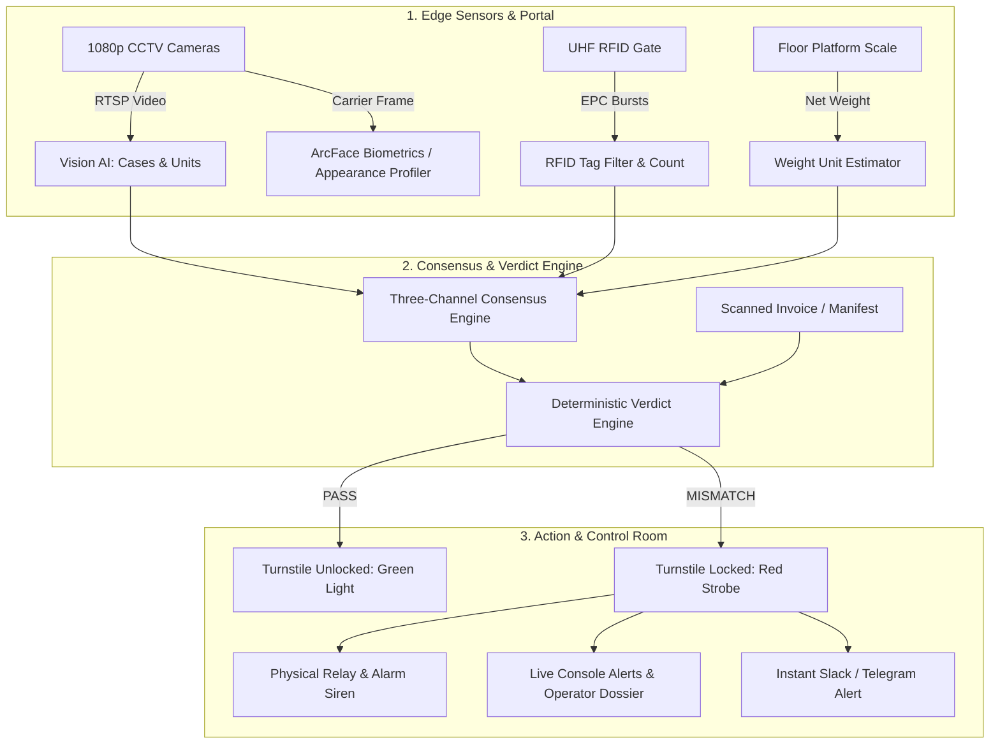

# SEC-OPS 2.0 — Official User Manual & Field Deployment Guide
**Autonomous Multi-Modal Retail Exit & Loss Prevention System**

---

## 1. System Overview & Operation Workflow

**SEC-OPS 2.0** is an enterprise loss prevention platform that monitors retail exit lanes, loading bays, and employee turnstiles in real time. It uses **Three-Channel Multi-Sensor Consensus Fusion**:
1. **Vision Inference**: High-speed edge AI (Megvii YOLOX + ByteTrack) counting case packs and singles.
2. **RFID Gate Reader**: UHF RF portal detecting energized item EPC tags.
3. **Floor Scale Weight**: Net floor platform load dividing by SKU weight specifications.



---

## 2. Operator Quick-Start Guide (Daily Store Operations)

This section is for **Store Operators, Security Guards, and Shift Supervisors**. No programming or engineering skills are required.

### Step 1: Open the Control Room Console
1. Open Google Chrome, Edge, or Firefox on the security monitoring workstation.
2. Navigate to: `http://localhost:5173` (or the server IP provided by IT, e.g., `http://192.168.1.100`).
3. You will see the **SEC-OPS 2.0 Industrial Dark Dashboard**.

---

### Step 2: Monitoring the Live Operations HUD
The **Dashboard View** gives you real-time visibility across all store exit lanes:
* **Live Camera Grid**: Shows active exit lane camera feeds in real time.
* **Top KPI Bar**:
  * **Today's Throughput**: Total number of verified inventory units that passed through portals today.
  * **Consensus Accuracy**: System health percentage (e.g. `98.8%`).
  * **Open Alerts**: Count of unresolved incidents requiring review.
  * **Active Lanes / Cameras Online**: Status of all connected hardware.
* **Camera Overlay HUD**:
  * **Green Box**: Item or person correctly detected and verified.
  * **Red/Amber Box**: Unverified item or unauthorized individual.
  * **IR Mode Tag**: Purple tag indicating active night-vision illumination.

---

### Step 3: Understanding Verdicts (PASS vs. MISMATCH)
Every time a cart passes through an exit lane, the system evaluates the cart within **0.8 seconds**:
* <span style="color:#22c55e; font-weight:bold;">🟢 PASS</span>:
  * Sensor consensus matches the declared manifest (within tolerance).
  * The turnstile gate remains **unlocked**, allowing immediate exit.
* <span style="color:#ef4444; font-weight:bold;">🔴 MISMATCH (Over-Carry / Under-Declaration)</span>:
  * Cart contents do not match the manifest (e.g., carrying 8 cases when only 6 were declared).
  * System sounds a control room alert, logs an incident, and can trigger turnstile auto-lock.

---

### Step 4: Investigating an Incident Dossier
When an alert or suspicious event occurs:
1. Click on **Events** in the left navigation menu.
2. Click on the flagged event (e.g., `EVT-2026-9045`).
3. The right-hand **Forensic Dossier Panel** will open:

#### A. CCTV Camera Snapshot
* Shows the exact recorded freeze-frame of the cart and carrier at the moment of exit.
* Displays timestamp, lane ID, and AI detection count overlay.

#### B. Carrier Dossier
* **If Verified Employee**:
  * Displays Employee Name, Job Role, Shift, and RFID Badge ID.
  * Displays **Match Similarity** (e.g. `98.50%`).
  * Displays **30-Day Verification History** (e.g. `1 Mismatch in Last 30 Days`).
* **If Unverified Carrier (`Appearance Summary (automated, approximate)`)**:
  * **Clothing Colors**: Visual color swatches showing Top and Bottom clothing colors (e.g. `Dark Navy` top, `Blue Jeans` bottom).
  * **Relative Build**: `SHORTER`, `AVERAGE`, or `TALLER` (compared to door-frame reference).
  * **Accessories**: Badges for detected accessories (`Bag: 88%`, `Cap: 76%`, `Glasses: 82%`).
  * **Repeat Sighting Frequency**: Banner indicating:
    `"This appearance pattern was seen at this store N times in the last 30 days"`.

#### C. Sensor Matrix & Packaging Arithmetic
* **Sensor Matrix**: Compares Vision Count vs. RFID Read Rate vs. Scale Weight Estimate.
* **Packaging Math**: Breaks down full sealed cases vs. loose singles.

---

### Step 5: Controlling the Turnstile Interlock
In the right-hand panel under **Portal Physical Interlock**:
* **Emergency Lock**: Click the red button **"Emergency Lock Turnstile"** to immediately drop the magnetic turnstile bar and halt exit.
* **Release Portal Lock**: Click the green button **"Release Portal Lock"** to release the turnstile and restore normal egress.
* *Safety Note*: The system automatically unlocks after 30 seconds to comply with building fire safety standards.

---

### Step 6: Acknowledging & Resolving Alerts
1. Click on **Alerts** in the navigation rail.
2. Select any **OPEN** alert.
3. Review the discrepancy detail (e.g., `Over-Carry +4 Units`).
4. Click **Acknowledge** to notify other supervisors that you are handling it.
5. Once physical verification is complete, enter your resolution note (e.g., *"Invoice corrected with vendor driver"*) and click **Resolve**.

---

### Step 7: Exporting Audit Reports (Excel & CSV)
1. In the **Events**, **Alerts**, **Invoices**, or **Reports** views, click the **Export** button in the top right.
2. Choose:
   * **Full Audit Package (.xlsx)**: Downloads a multi-tab Microsoft Excel workbook containing:
     * Tab 1: Exit Events Log
     * Tab 2: Alerts & Discrepancies
     * Tab 3: Product Catalog
     * Tab 4: Manifests / Invoices
     * Tab 5: Security Action Audit Trail
   * **Current View (.csv)**: Downloads a flat spreadsheet of the current table.

---

## 3. Hardware Installation & Wiring Guide (For Field Technicians)

> [!CAUTION]
> Electrical wiring of 12V/24V power supplies, relay modules, and turnstiles should only be performed by a qualified electrician or IT hardware technician to avoid electrical hazards or equipment damage.

---

### A. Network & Power Topology
* **Network Switch**: Install an 8-Port or 16-Port Gigabit **PoE+ (802.3at)** managed switch in the telecom rack.
* **IP Addressing**: Assign static IPs on the surveillance VLAN:
  * Edge Controller / Server: `192.168.1.10`
  * Camera Lane 1: `192.168.1.101`
  * Camera Lane 2: `192.168.1.102`
  * RFID Reader Lane 1: `192.168.1.201`
  * Scale Indicator: `192.168.1.250` (or USB)

---

### B. Installing & Pairing Cameras
1. Mount the 1080p ONVIF IP Dome camera over the exit lane looking toward oncoming carts at a 30° down-angle.
2. Run a Cat6 network cable from the camera to the PoE switch.
3. **Pairing Camera into Console**:
   * Open **Settings -> Camera Fleet**.
   * Click **Pair New Camera**.
   * **Method 1 (Automatic QR Code)**: Click *Generate Pairing QR*, print or display the code on your phone, and hold it 30 cm in front of the camera lens for 3 seconds. The camera auto-registers.
   * **Method 2 (Manual IP Input)**: Enter Label (e.g., `Exit Lane 1`), IP address (`192.168.1.101`), RTSP path (`/Streaming/Channels/101`), and click *Save & Test Connection*.

---

### C. Installing the Floor Scale
1. Position the industrial steel platform scale flush with the floor surface at the exit portal.
2. Level all 4 load cell feet so the platform does not wobble.
3. Connect the load cell summing box to the digital indicator terminal.
4. Connect the indicator terminal to the Edge Computer:
   * **Using USB**: Plug RS-232-to-USB cable into Edge PC port (`COM3` or `/dev/ttyUSB0`).
   * Set baud rate to `9600 8-N-1` with continuous ASCII stream mode.
5. In **Settings -> Lane Hardware**, enter the scale tare weight (weight of an empty standard shopping cart, typically `18.5 kg`).

---

### D. Installing the UHF RFID Portal
1. Mount 2 circular polarized patch antennas on each side of the portal frame at heights of 0.8m and 1.4m.
2. Angle antennas 15° inward facing the lane.
3. Connect low-loss coaxial cables (SMA-to-TNC) to the Impinj/Zebra 4-port reader.
4. Plug Cat6 PoE cable into the reader.
5. Set power output in reader configuration to `27 dBm` (balances detection coverage without reading tags in adjacent aisles).

---

### E. Wiring the Turnstile Lock & Alarm Siren Relay (GPIO)

Connect the Optocoupled 5V Relay Module to the Raspberry Pi / Edge GPIO header:

| Raspberry Pi Pin | Pin Name | Wire Destination on Relay Module | Purpose |
| :--- | :--- | :--- | :--- |
| **Pin 2** | 5V Power | `VCC` | Powers the relay optocoupler logic |
| **Pin 6** | Ground | `GND` | Common ground reference |
| **Pin 11** | BCM GPIO 17 | `IN1` | Turnstile Lock Trigger (Active High) |
| **Pin 13** | BCM GPIO 27 | Microswitch NC Terminal | Mechanical Readback Confirmation |

#### Turnstile & Siren Power Circuit (High Voltage Side):
```text
[+12V / +24V Power Supply (+)] ───> [Relay COM Terminal]
                                           │
                                     (Relay Switched)
                                           │
[Relay NO Terminal]             ───> [Turnstile Magnetic Solenoid (+)] 
                                     & [Alarm Siren (+) Red Wire]

[Power Supply Return (-)]       ───> [Turnstile Solenoid (-)] 
                                     & [Alarm Siren (-) Black Wire]
```

* **Fail-Open Life Safety Protocol**:
  * The code enforces `NO` (Normally Open) logic. If the server is powered off or unplugged, the circuit is open and the turnstile **instantly unlocks** for fire egress.
  * The software driver has a built-in **30-second watchdog timer** that automatically disengages the lock after 30 seconds.

---

## 4. Administration & Store Configuration

### A. Adding / Editing Products
1. Navigate to **Catalog** in the navigation menu.
2. Click **Add Product**.
3. Fill in:
   * SKU Code (e.g. `SKU-WTR-500-24`)
   * Product Name & Category
   * **Pack Size (Units per Case)**: *Crucial for packaging math (e.g. 24 units per box).*
   * **Unit Weight (grams)**: *Used by the floor scale engine (e.g. 520g).*
   * Unit Price & Case Price (INR)
4. Click **Save Product**.

---

### B. Registering Employees & Face Biometrics
1. Navigate to **Personnel**.
2. Click **Register Employee**.
3. Enter Name, Job Role, Shift (Morning/Evening/Night), and RFID Badge ID.
4. **Biometric Face Enrollment**:
   * Click **Enroll Face Camera**.
   * Have the employee face the enrollment webcam.
   * The system extracts the 512-dimensional ArcFace vector and stores it securely in the local database.

---

### C. Processing Delivery Invoices / Waybills
1. Navigate to **Invoices**.
2. Click **Upload Waybill / Invoice**.
3. Select PDF or image file (`.pdf`, `.png`, `.jpg`).
4. The system executes automated **PaddleOCR**:
   * Extracts Invoice Number, Carrier Name, and Destination.
   * Detects line items, quantities, and case multipliers.
   * Compares declared totals against portal exit events automatically.

---

## 5. Troubleshooting & FAQ

### Q1: The turnstile did not unlock automatically. What should I do?
* **Solution 1**: In the Control Room Console, open the active event dossier and click the green **"Release Portal Lock"** button.
* **Solution 2**: All compliant turnstile hardware includes an emergency break-away drop-bar. In an evacuation, firmly press down on the horizontal arm to drop it manually.
* **Solution 3**: If power fails, the turnstile drops open automatically.

### Q2: A wall poster or picture of a person triggered a face alarm. Why?
* **Answer**: SEC-OPS 2.0 includes a **Two-Stage Static Image Discrimination Engine**. If a poster, framed photograph, or laptop display is seen, the system automatically marks it as `STATIC_IMAGE`, logs the record in *Settings -> Static Detections*, and **suppresses the alarm** so guards are not disturbed.

### Q3: Why does a camera tile show "IR / Night Mode"?
* **Answer**: In low-light or night conditions, cameras switch on infrared illuminators. SEC-OPS 2.0 detects monochrome IR video ($S < 12$), adapts contrast using CLAHE, and adjusts facial recognition thresholds to prevent false intrusion alarms while maintaining accurate package detection.

### Q4: How do I export records for a legal or corporate audit?
* **Answer**: Go to **Reports**, click **Export Full Audit (.xlsx)**. This generates an encrypted, tamper-evident Microsoft Excel workbook with timestamped logs across all 5 operational databases.

### Q5: How do I connect a USB Weight Scale or Webcam? Does it connect automatically?
* **Answer**: **Yes, 100% automatically (zero clicks).** Simply plug the USB cable into any USB port on the edge computer. The system immediately detects the hardware signature (VID/PID), opens the COM/serial port, auto-assigns it to Lane 1, and persists the setting across reboots. You can verify the active status in *Settings -> 5a. Zero-Click USB Hardware Auto-Detect*.

### Q6: Can LAN/WiFi cameras connect without typing IP addresses?
* **Answer**: **Yes.** The system runs continuous background discovery (ONVIF WS-Discovery, mDNS, and subnet sweep) and pre-tests reachability and RTSP video streams automatically. Discovered cameras appear in the *Auto-Discovered Network Devices* banner in *Camera Settings*. The operator simply clicks **"Confirm [Lane X]"** once to confirm the physical exit door. After that single click, the camera connects and streams automatically forever.

---

**End of User Manual**  
*System Version: SEC-OPS 2.0.0 (Build 2026.09)*  
*Document Ref: DOC-SO2-MANUAL-V1*

